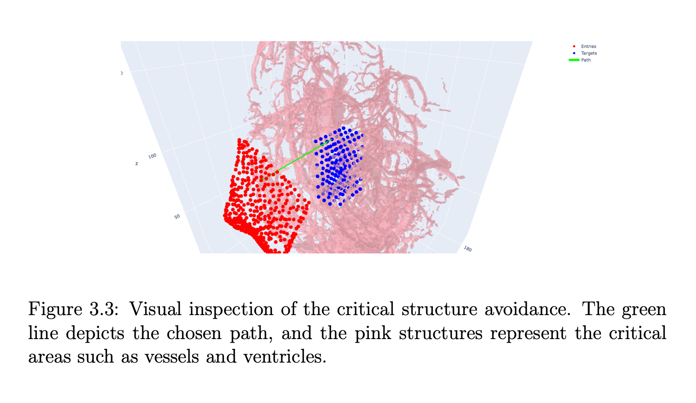

This document outlines the requirements and steps to execute the end-to-end pipeline and visual validation of the calculated trajectory for the project. It also discusses unit testing and includes notes on the creation of the work space and individual packages.

# Requirements
To install the necessary requirements for this project, use the pip command as follows:
```pip install -r requirements.txt```

# End-to-End Pipeline
You can execute the entire pipeline by running the shell script: 
```source pipeline.sh```

Please note that the pipeline requires Torch with CUDA drivers installed. The pipeline does not include the Visual Validation of the calculated trajectory, which must be run separately.

# Visual Validation of the Calculated Trajectory
To perform visual validation, you need to:

1. Plan the path (if the pipeline hasn't been run): ```python 1_plan_path.py```
2. Show volume: ```python 2_show_volume.py```

This process ideally opens three browser windows in the terminal, each displaying the trajectory and one structure.

# Unit Test
To conduct a unit test for the check_intersect_batch function, which is the main function that selects the trajectory meeting the desired constraints, use the following command:
```python test.py```
Detailed descriptions of the function and its operations can be found in the docstrings and inline comments in the script.

# Critical Structure Avoidance


# Video Demo of Moving the Arm
[](https://www.youtube.com/watch?v=P7g-ps6yXE8&ab_channel=DonYin)

# Video Demo of the End Effector Orientation Error
[](https://youtu.be/jtVrFUUL0fA)
Note: as mention in the discussion of the report, there is a small error incalculating the orientation of the needle remaining unsolved.

------

# Repository Development Notes
Below are some notes associated with the development of the repository, covering aspects such as workspace creation, package creation, and ROS topics.

## Workspace Creation
The workspace was created using the ```catkin_make``` command, which generated the following directories:
- ```src``` and ```src/CMakeLists.txt```
- ```devel```
- ```build```

## Package Creation
All packages were created within the src folder. New directories were made using the command: 
```catkin_create_pkg package_name dependencies```

## ROS Topics
To display a list of ROS topics, use: 
```rostopic list```
To echo data from a particular topic, use: 
```rostopic echo topic_name```
